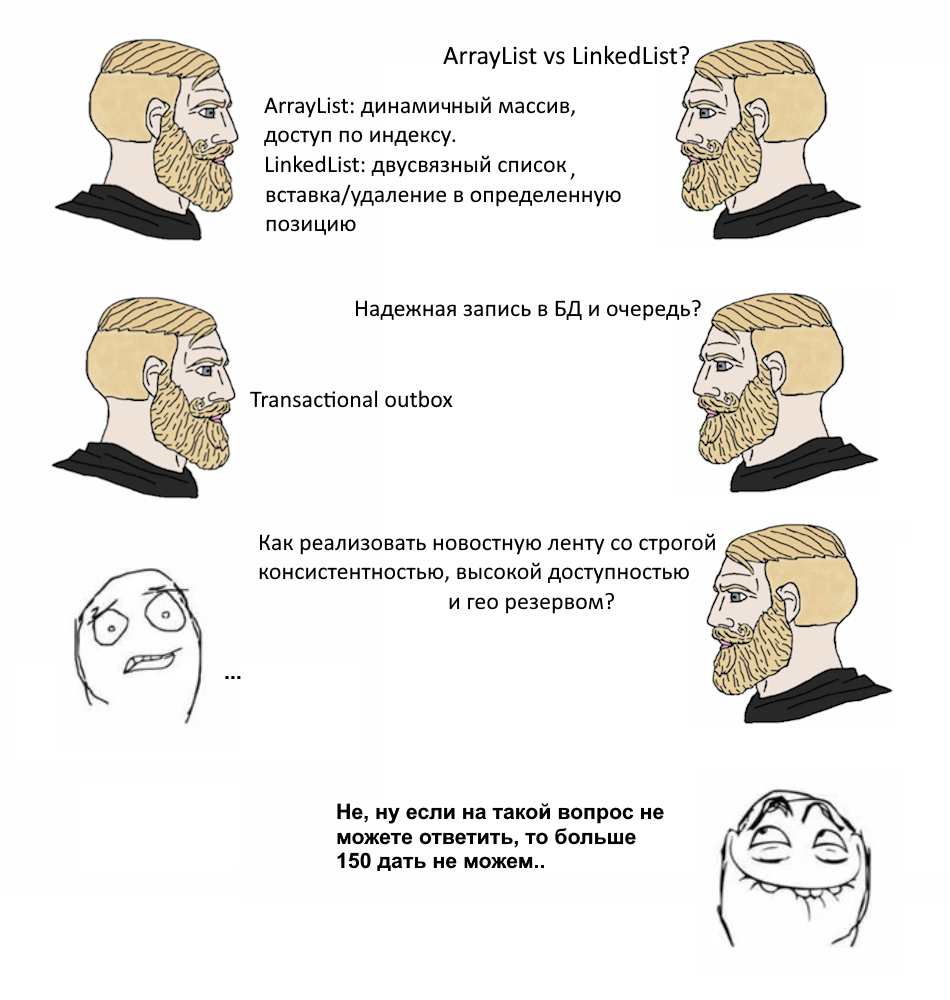

# Cобеседования

- [Cобеседования](#cобеседования)
    - [Введение](#введение)
    - [Этапы](#этапы)
        - [Разговор с HR](#разговор-с-hr)
        - [Техническое собеседование по ЯП](#техническое-собеседование-по-яп)
        - [Design Review](#design-review)
        - [Знакомство с руководителем](#знакомство-с-руководителем)
        - [Знакомство с командой](#знакомство-с-командой)
    - [Советы](#советы)
        - [Не бойтесь ошибиться](#не-бойтесь-ошибиться)
        - [Будьте честны](#будьте-честны)
        - [Не затягивайте, но и не соглашайтесь сразу](#не-затягивайте-но-и-не-соглашайтесь-сразу)
        - [Важность видеть собеседника](#важность-видеть-собеседника)
        - [LeetCode/Live coding](#leetcodelive-coding)
        - [Тестовое задание на дом](#тестовое-задание-на-дом)
        - [ChatGPT и ИИ](#chatgpt-и-ии)
        - [Настаивать на неправильном ответе](#настаивать-на-неправильном-ответе)
        - [Собеседование в паре](#собеседование-в-паре)
        - [Критически смотрите на процесс ваших собеседований](#критически-смотрите-на-процесс-ваших-собеседований)
    - [Что отталкивает кандидатов](#что-отталкивает-кандидатов)
        - [Неуважение](#неуважение)
        - [Вопросы не по делу](#вопросы-не-по-делу)
        - [Монолог на собеседовании](#монолог-на-собеседовании)
        - [Отсутствие обратной связи](#отсутствие-обратной-связи)
        - [Прояснение деталей после большинства этапов](#прояснение-деталей-после-большинства-этапов)
    - [Итого](#итого)
    - [Домашнее задание](#домашнее-задание)
    - [Полезные материалы](#полезные-материалы)
    - [Отдельные благодарности](#отдельные-благодарности)

## Введение

Собеседование - это важнейший процесс, по итогу которого принимается решение о найме кандиата.

Во время этого процесса обе стороны (как нанимающая, так и нанимаемая) присматриваются друг другу, стараются понять насколько они заинтересованы в сотрудничестве.

Это очень важно понимать - что это обоюдный процесс и то, как вы проводите собеседования может как негативно, так и позитивно, отразиться на впечатлении о вас и компании.

В разных компаниях процесс собеседования построен по своему: где-то три этапа, где-то два, у кого-то вообще пять и более.
Где-то есть возможность получения информации об ответах кандидата на предыдущих этапах, где-то такой возможности нет (или она усложнена), где-то дают тестовые задания, а где-то нет и т.д.

Однако, не смотря на это, общие темы можно выделить и о них важно проговорить.

Здесь мы рассмотрим процесс найма разработчика, но в целом, с некоторыми изменениями, это актуально для любой роли.

## Этапы

На данный момент в плюс-минус больших компаниях выделяют следующие этапы:

* Разговор с HR
* Техническое собеседование по ЯП
* Проектирование (или Design Review)
* Знакомство с руководителем
* Знакомство с командой

Иногда техническое собеседование по ЯП и Design Review объединяют в монособеседование, которое длится часа три, но чаще их ставят в разные временные слоты.

На около-менеджерские должности (например, того же тимлида) еще ставится именно менеджерское собеседование: разговор про церемонии команды, разбор гипотетических ситуаций, как например, конфликт в команде или планирование фичи.

Также, зачастую знакомство с руководителем и командой объединяют вместе, однако не всегда и не везде.

Важно понимать, что количество этапов зависит еще и от того, какого грейда вы ищите человека и какие у вас исходные данные.

Под исходными данными я подразумеваю любые данные, которые на вас могут повлиять: срочность закрытия вакансии, возможность влиять на процесс найма (не во всех организациях это возможно), грейдовый состав и загруженность команды, культуру, размер компании даже и т.д.

Например: у вас сплоченная команда и вы достаточно заранее понимаете, что можно взять стажера/джуна для постепенного его роста и усиления команды. Это не критическая вакансия, сроки не поджимают и вы можете вообще попробовать закрыть ее через какой-то нетворкинг и не тратить время (а значит и деньги) на весь процесс найма (с всякими hh, большим количеством собеседований и всей цепочки). Можно даже попробовать убрать большую часть этапов, возможно, заменив что-то тестовым заданием даже.

### Разговор с HR

Поскольку вы, как руководитель, заранее составили [портрет кандидата](./job_description.md#портрет-для-найма), убедитесь, что ваш HR этот портрет увидел(а).

По возможности, лучше даже созвониться и по нему пробежаться вместе.

Обычно у HR-специалистов, в силу специфики профессии, достаточно неплохо получается видеть плюсы и минусы кандидатов. Не всегда, бывают шероховатости, но в целом полезно этим воспользоваться. HR может вам подсветить какие-то проблемы в общении кандидата, в его поведении или ответах. Это происходит потому, что HR имеет большой опыт общения с разными кандидатами, а количество переходит в качество. Ну и нельзя не отметить, что у HR должен быть (в силу профессии) развит эмоциональный интеллект.

Отсюда, чем более схоже вы представляете искомого кандидата - тем более качественный отбор будет к следующему этапу - техническому собеседованию.

Поэтому очень важно синхронизироваться с HR: при чем как в самом начале, так и вообще в процессе, что-то корректируя, например.

Если есть возможность, то лучше попросить HR давать некоторую выжимку информации, впечателния по кандидатам, которые проходят на следующий этап - техническое собеседование. И самим давать обратную связь, когда она подкопится.

На мой взгляд, вот эта не синхронизированность с HR - это первая ошибка и ее много кто допускает.

Да я и сам одно время грешил тем, что не считал помощь и влияние HR чем-то серьезным. Могу точно сказать, что часть неудачных и даже неприятных собеседований технических мы могли бы избежать, если бы с HR синхронизировались и не пренебрегали бы этим.

Еще важно проговорить тему технических вопросов на этапе скрининга с HR или с рекрутером (когда на этапе созвона задаются несколько технических вопросов).

Я считаю HR должен говорить про опыт и про общие вещи (понимание портрета кандидата и сравнение с нашим искомым), но не про технику.

Почему? Тому виной следующие причины:

* Зачастую HR (и уж тем более рекрутер) технически не готов

    Человек может вообще на нескольких треках (искать несколько ролей сразу) работать. Либо банально не имеет глубоких знаний по этой роли.
    В таком случае, скорее всего, будет составлен некоторый набор простых вопросов с ответами, по которому будет идти HR и сравнивать ответы кандидата с написанными.

* Странные или ошибочные вопросы (и ответы) от HR могут отпугнуть кандидатов

    Здесь все просто, если человек не разбирается в том, что спрашивает - это будет сразу понятно. И пользы от такого общения будет немного, а вот рисков таит в себе достаточно.

    Представьте, что на первой встрее (считай - знакомстве) вас спросят вопрос, вы ответите на него и вам скажут: нет, это не верный ответ. Вы спросите - а почему? И тут вам ответить уже не смогут. Первое впечатление будет точно испорчено.

* Пользы от этих 'базовых' вопросов мало

    То, что кандидат не подходит по навыкам, в целом можно определить через вопросы про его опыт и понимание предметной области, в которой он работал.

    Банально вопросы про что делал и зачем, с какими трудностями сталкивался и какую последнюю фичу реализовал, больше скажут о кандидате для HR, чем ответ что такое семафор.

В итоге это не выгодно (как с экономической, так и с репутационной точки зрения) и является лишним стрессом для всех участников (начиная HR/рекрутером и заканчивая кандидатом).

### Техническое собеседование по ЯП

Казалось бы, что здесь все просто, но это только на бумаге так кажется. На деле же все гораздо сложнее.

Понятно, что здесь надо оценить кандидата по хард-скиллам и принять решение о допуске на следующий этап или нет. Но также здесь важно еще и понять то, как кандидат думает, размышляет, насколько ваши (вашей команды) взгляды на разработку с ним сходятся и т.д.

Иногда собеседование проводите вы, как тимлид, иногда — ваш коллега. Также бывает, что его проводит программист(ы) компании, не имеющий(е) к вам или вашей команде прямого отношения.

И первый, как мне кажется, подводный камень тут в том, что на этом этапе вроде бы должны спрашивать вопросы именно по тому, что у вас написано в описании вакансии, в разделе 'Ожидания', но на деле это не всегда так.

Очень часто встречается ситуация, когда то, что спрашивают - это вообще вопросы, которые просто пришли собеседующему в голову в этот момент, о которых он вот сейчас подумал.

Бывает еще такое, когда в компании есть некоторый общий пул вопросов (распределенные системы, многопоточность, по работе под высокой нагрузкой, про SQL, про NoSQL, паттерны - да огромное количество всего) и в этом пуле просто все, что вообще можно было бы придумать/спросить, он огромный. И я встречал ситуации, когда собеседующий просто идет по этому пулу вопросов подряд, несмотря на то, что вопросы не всегда совпадают с искомой спецификой вакансии.

Грубо говоря, вы ожидаете кандидата с уверенным владением SQL (сложные запросы), большим опытом в реляционных БД, готовы закрыть глаза на слабые знания в многопоточности Java, приходит такой кандидат и его спрашивают по многопоточности в Java, по распределенным системам, по многим вещам, которые не так уж и связаны с искомым портетом и на которые мы могли бы закрыть глаза или подтянуть. И вот такой кандидат не проходит или получает низкий грейд оценки, после чего уходит к вашим конкурентам.

Это не говорит о том, что не надо спрашивать эти вопросы или они плохие, смысл в том, чтобы спрашивать их тогда, когда вы уже хотите понять кругозор. Но до этого надо вообще понять - подойдет ли кандидат под ваши задачи и требования.

В идеале вообще подготовить свой чек-лист по тому, что вы ожидаете от человека на базе описания вакансии и портрета.

Как это лучше сделать?

Из описания требований по вакансии и планируемым задачам выделить основные блоки.

Например:

```text
Наши ожидания:

- Опыт работы в роли Java разработчика от 3-х лет
- Используете Spring Boot для ваших сервисов
- Опыт разработки интеграционных решений (REST API, Kafka)
- Опыт принятия архитектурных решений в проектировании распределенных систем
- Умеете тестировать свой код (Unit и интеграционные тесты)
- Проводили код-ревью
- Умеете работать в условиях неопределенности требований
```

В таком случае, я бы выделил следующие блоки:

* Блок про опыт кандидата

    Здесь важно понять насколько человек понимал что он делал на прошлой работе.

    Чем более ясно и четко кандидат сможет рассказать суть прошлого проекта/проектов, чем более хорошо он понимает предметную область, в которой работал - тем ценнее этот кандидат.

* Блок Java Core

    Общие вопросы по Java Core, так как мы ожидаем, что кандидат уже давно пишет на Java.
    Это хорошая тема для старта, можно начать с простых вопросов, чтобы наладить контакт, дать кандидату почувствовать уверенность.

    Иногда в этом блоке дают задачу с leetcode.

    Но я считаю, что обязательно давать небольшую задачу именно на код. Важно увидеть как человек пишет код, насколько он с ним на 'ты'. Это не должна быть сложная задача, необязательно прямо на алгоритмы, для меня важно именно то как человек пишет и насколько легко ему это дается.

* Блок ревью сервиса на Spring

    Для нас важно, чтобы человек проводил код-ревью и писал на Spring-е, поэтому можно совместить оба требования в этой секции.
    Заранее подготовить код, например, контроллера и сервиса, с большим или средним количеством ошибок (длинные транзакции, смешивание слоев абстракций и т.д.)

    Таким образом, проверим и то, как кандидат видит проблемы в коде, и в целом опыт.

* Блок про интеграции

    Дать задачу на построение архитектуры сервиса, где проверить то, как кандидат умеет собирать требования (работа в условиях неопределенности), какие подходы знает в интеграциях, общий кругозор. Задача небольшая и не как в Design Review, а более упрощенная. Попросить спроектировать REST API, поговорить про очереди и их применение. Отсюда же можно, в зависимости от вакансии, пойти в сторону устройства той же Kafka, либо, как вариант, про идемпотентные запросы поговорить.

* Блок ответов на вопросы

    Ответы на вопросы кандидата.

На все это может уйти от полутора до двух часов.

### Design Review

Для грейдов ниже Middle+ я бы эту секцию вообще не проводил, а спрашивал бы все необходимые вопросы в предыдущей.

Для старших грейдов это уже важная секция, где можно понять насколько опытный человек или насколько у него широкий кругозор.

Будем честны, зачастую, кандидатов, кто с нуля проектировал системы, не так много, большая часть именно готовится по каким-то материалом (типа Cracking Design Interview).

Но эта секция позволяет понять насколько человек умеет собирать требования, проектировать по ним, принимать решения (в том числе неудачные) и как реагирует на эти решения он.

Здесь также необязательно просить проектировать Google или создавать с нуля Netflix, вполне можно обойтись более простыми задачами.

Несмотря на все это, я считаю, что секция важная, но опять же, зависит от того - кого вы ищете, какой портерт кандидата.

### Знакомство с руководителем

Если вы и собеседовали человека, то секцию пропускаем. Если процесс найма выстроен так, что прошлые секции были без вас, то я считаю, важным встретиться тет-а-тет с человеком, который прошел уже все этапы и находится на финальной стадии.

Почему это важно?

Так как вы будете непосредственным руководителем, то это можно рассмтаривать как встречу на уровне one-to-one. На ней вы познакомитесь, пробежитесь по опыту, расскажете о себе и проекте подробнее, обсудите проблемы, спросите кандидата о чем-то.

И самое главное - вы увидете реакцию его на ваши слова, на обсуждение, послушаете уже его вопросы. Это очень важно с точки зрения руководителя, уже на этой стадии вы можете понять насколько человек подходит по портрету.

Почему я бы не совмещал это с следующим этапом по знакомству с командой?

Во-первых, некоторые вопросы/проблемы/темы вы, возможно, захотите обсудить не в общем кругу. Например, если кандидат спросит, куда делся предыдущий разработчик/тимлид/аналитик/тестировщик или поинтересуется своими первыми задачами, совсем не обязательно, чтобы это слушали все.

Во-вторых, эта встреча это как пред-финал, а командное время стоит очень дорого. Вдобавок, это тратит силы и сбивает фокус сотрудников с текущих задач.

Поэтому я бы разделял этапы и проводил знакомство с командой только тогда, когда всё уже готово и мы, по сути, можем сделать оффер.

В-третьих, надо помнить, что вы человека увидели впервые (как и он вас), первое знакомство иногда бывает скомканным, кто-то стесняется, кто-то переживает - идет этап отрицания. Поэтому этой встречей вы еще и облегчаете следующий этап - знакомства с командой.

Обязательно постарайтесь записать мысли по кандидату - это пригодится вам для следующего этапа.

### Знакомство с командой

На мой взгляд этот этап важен, хоть многими и игнорируется.

Звать на эту встречу всю команду, на мой взгляд, не стоит, так как это вряд ли принесёт ожидаемую пользу. Кроме того, большое количество новых и незнакомых людей может напугать некоторых кандидатов.

В идеале - это позвать нескольких лидеров команды, обязательно того, кто (по вашему плану) будет наставником (отвечать за onboarding) или эдаким buddy, человеком, к которому новичок всегда может обратиться и который его будет погружать в курс дела.

Желательно, пригласить тех, с кем человек будет взаимодействовать чаще всего на первых порах. Например, для разработчика - это лид разработки, тестировщик, может devops (если есть выделенная роль).

Сравните свои записи с мыслями ваших лидеров.

На этом этапе уже принимается решение о найме.

## Советы

### Не бойтесь ошибиться

Не надо бояться ошибок, так как во-первых, есть испытательный срок, где как раз и проверяется самое главное.
А во-вторых, боязнь ошибиться может привести вас к неуверенности в ваших решениях.

Пробовать - это нормально. И ошибаться - тоже нормально. Главное - это правильно реагировать на свои ошибки.

### Будьте честны

Важно быть честным с самого начала. Нет смысла 'скрывать' негативные моменты и вещи в вашей команде/организации, так как это все так или иначе в любом случае всплывет. И нет ничего хуже, чем если человек вышел, понял ваш обман и уволился: это и демотивация команды, и впустую потраченные деньги на найм и снова открытый найм (а значит затраты и силы).

В моей практике был случай, когда на проекте были on-call дежурства, достаточно затратные по времени и силам. И про них на собеседовании (и в вакансии) не сказали, кандидат принял решение выбрать именно этот проект и был неприятно удивлен тем, что есть такие дежурства, включающие и выходные. Человек был семейный, дополнительно к этому у него был часовой пояс с существенной разницей с тем, в котором основные 'проблемы' на дежурствах возникали.

Результат: он ушел через полгода и это была одна из причин его ухода.

Вот, к примеру, правильный подход:

```text
Наши ожидания:

- Высшее образование
- Опыт работы в качестве разработчика C/C++ от 4-х лет
- Опыт работы с Linux на уровне администратора
- Опыт решения нестандартных задач
- Понимание и уважение к legacy
```

Т.е. если для вас важно образование - вы явно его указываете в ожиданиях и требованиях.
Если у вас много legacy кода и надо уметь с ним работать (а не бросаться все сразу переписать), вы прямо честно об этом заявляете.

Да, воронка будет меньше, но и качество будет лучше.

### Не затягивайте, но и не соглашайтесь сразу

Еще одной частой ошибкой бывает то, что после нескольких неудачных кандидатов вы уже соглашаетесь на найм первого более-менее понравившегося.

Зависит от ситуации, но надо понимать, что найм - это не быстрый процесс и если есть возможность, то лучше искать наиболее подходящего вам человека. Нередки случаи, когда после такого вот более-менее подходящего кандидата, после 'черной' полосы, начинается 'белая' полоса.

Не давайте волю эмоциям и не торопитесь.

### Важность видеть собеседника

Сейчас очень много собеседований проводится онлайн, поэтому очень важно заранее кандидатам сказать (через HR, например) что наличие камеры - это обязательное условие собеседования.

И дело тут не в том, что кто-то хочет убедиться, что вы не пользуйтесь шпаргалками или еще чем-то, а в том, что важно понимать как вы выглядите, как реагируете на вопросы, как думаете.

Внешние проявления и реакции важны, по ним в том числе формируется понимание о кандидате.

### LeetCode/Live coding

Это традиционно холиварная тема для найма разработчиков. Не всем это нравится и многие вообще предпочитают обходиться без live coding-а, считая это черной меткой.

Но я так не думаю и считаю важным дать небольшую задачу уровня easy для кандидата.

Почему?

Дело в том, что для меня очень важно, чтобы кандидат, что называется, не боялся кода.

Часто на собеседованиях я подмечал, что как только дело доходит именно до кода и работы с ним человек, даже высокого грейда, как будто начинал тушеваться и сбиваться.

Важно подметить, что для меня не принципиально, чтобы секция проходила как white board или в блокноте, где нет подсветки или автодополнения. Как раз наоборот, лучше, чтобы дополнения кода и подсветка были. Вы же не разрабатываете ваши сервисы в блокноте? Вот ровно и тут такой же подход.

Но посмотреть насколько человек уверенно владеет ЯП для меня важно.
Здесь не нужно делать упор на алгоритмы, акцент я делаю на именно владением ЯП. В целом, некоторые вещи можно даже с ошибками написать, главное рассуждать и не бояться кода, не бояться писать.

### Тестовое задание на дом

А вот тестовые задания для меня не настолько важны и давать я их не люблю.

Во-первых, это свободное время кандидата, которое он тратит бесплатно. Что не совсем честно.

Во-вторых, на проверку тестовых заданий и написание обратной связи по ним уходит много времени и сил.

В-третьих, во время выполнения тестового задания я не вижу или не понимаю как рассуждает кандидат: это вполне может быть ИИ, какой-то другой человек может его выполнять, никто никаких гарантий не дает.

В-четвертых, сейчас это может отпугнуть некоторых кандидатов, так как многим очень не нравится подобный процесс.

Из всего этого выходит, что по сумме затрат и приносимой пользы этот этап скорее играет в минус, чем в плюс. И в итоге он не выгоден.

Исключения может составить разве что найм стажеров, где по такому ДЗ можно построить диалог собеседования впоследствии.

### ChatGPT и ИИ

Отношение к этому инструменту на собеседованиях в 99,9% случаев будет негативным. Я тут не исключение и также считаю, что на самом собеседовании это недопустимо.

Умение им пользоваться может быть расценено как бонус (и то не всегда), но на самом собеседовании хочется посмотреть на ваши мысли, а не умение гуглить или формировать вопрос к ИИ (что, повторюсь, иногда может быть как бонус, но такое отдельно обговаривается).

ИИ и ChatGPT - это интсрументы, а на собеседовании в основном проверяется именно ваше умение мыслить и логика.

### Настаивать на неправильном ответе

Еще одна холиварная тема.

Во время собеседования на некоторых вопросах, я могу иногда 'покачать' в неправильную сторону его ответ для того, чтобы посмотреть насколько он а) уверен в своих знаниях и б) как реагирует на такие ситуации, когда человек говорит неверные вещи как утверждение.

Для меня важно, чтобы если человек знает, то он уверен и будет стоять на своем. Даже если ему говорят, что это не так работает.

Здесь важно не переусердствовать, но один-два раза так сделать и посмотреть на реакцию кандидата бывает очень полезно.

### Собеседование в паре

Также, по возможности, лучше постараться проводить технические собеседования в паре с кем-то еще.

Это позволит собрать более цельное представление о кандидате, добавит второе мнение.

При этом не стоит перегибать палку и приходить более чем два человека, так как будет создаваться эффект толпы и такое может как смутить, так и вовсе оттолкнуть кандидата.

Не так давно я проходил собеседование и там было пять человек на нем, помимо меня. Каждый хотел задать какой-то свой вопрос, выглядело это странно и некомфортно.

### Критически смотрите на процесс ваших собеседований

Ну и последний совет - это читайте отзывы и статьи по собеседованиям в другие компании (ссылки я приведу в разделе Полезные материалы). Таких статей и отзывов много и там зачастую можно подчерпнуть интересные мысли.

Рефлексируйте и анализируйте метрики по воронкам, по количеству и причинам отказа.

Но важно отметить, что суть этого не в том, чтобы 'подстроиться' под толпу, а грамотно подметить то, что вы считаете важным и имеющим суть, то, что вы сможете встроить в ваш процесс собеседований.

Не всегда то, что многим не нравится - это плохо.

Например, будем честны, я live coding/leet code не люблю, но считаю, что это полезная практика.

## Что отталкивает кандидатов

### Неуважение

Главный отталкивающий фактор - это разного рода проявление неуважение к кандидату.

Сюда можно сразу отнести опоздания (неуважение к времени кандидата), плохое знакомство с его резюме (неуважение к кандидату), переход на ты, без обговоренности, что это удобно, различного рода хаос (когда на собеседовании спрашивают 'А вы на какую вакансию собеседуетесь?'), постоянные повторы одних и тех же вопросов на разных этапах (когда вас в третий раз спросят чем вы занимались на прошлом месте работы - вы поймете что я имею в виду) и т.д.

Еще одним важным моментом является то, что если вы поняли, что человек не знает какую-то тему, не ответил на ряд вопросов, то не надо его 'топить' дальше по этой теме. Отметьте, что это пробел у кандидата и перейдите к следующей теме.

Собеседование - не место для поднятия своей самооценки!

Представьте себя на месте кандидата и поймете, что может оттолкнуть от вас и вашей организации человека.

### Вопросы не по делу

На самих собеседованиях явным красным флагом обычно являются вопросы не по делу или не по статусу вакансии.

Если половина ваших вопросов на собеседовании по вакансии Senior разработчика - это то, как устроена HashMap-а, то это по настоящему хороших кандидатов может отпугнуть.

Это работает и в обратную сторону: если собеседование проводится на уровень middle или junior+, то вопросы уровня TechLead задавать не стоит.

Лучше всего это демонстрирует следующая иллюстрация:



Также, если большое количество вопросов не связаны с вакансией и ее требованиями, это тоже может заставить задуматься о том, что, возможно, вы сами не знаете кого ищете или процесс найма выстроен плохо.

### Монолог на собеседовании

Надо помнить, что собеседование — это в первую очередь диалог. И в нем участвуют обе стороны.

И когда ваше собеседование превращается в монолог, например, собеседующего - это просто становится каким-то тестированием. А такое мало кому нравится и приятно.

При этом, даже если кандидат не ответил на несколько вопросов, вы всегда можете сделать небольшой обзор ошибок, порассуждать и так далее.

Таким образом и кандидату будет приятно и полезно ваше общение, и вы поднимите репутацию вашей компании.

Еще очевидная рекомендация, но как показывает практика, очень много кандидатов и собеседующих ей пренебрегают. Это не перебивать друг друга, не выходить на эмоции и вести уважительный диалог.

### Отсутствие обратной связи

Отсутствие обратной связи является неприятным фактором и вредит репутации компании, усложняет дальнейший найм (так как новости о 'плохих' компаниях быстро распространяются).

В обратной связи выделить темы, которые вы посчитали пробелом в знаниях у кандидата. Иногда присылают еще список материалов, позволяющий закрыть эти пробелы, но я считаю, что это уже лишнее.

Почему?

Во-первых, я считаю, что человеку надо дать вектор движения, а как двигаться он сам разберется.

Во-вторых, зачастую эта практика без должного контроля (которого обычно нет) скатывается в копи-пасту каких-то стандартных книг/ресурсов и не всегда это по делу.

В-третьих, такие материалы надо всегда актуализировать, что несет дополнительные издержки и отвлекает.

### Прояснение деталей после большинства этапов

Одним из самых странных, но тем не менее, встречающихся и невероятно отталкивающих моментов является прояснение важных деталей уже после большого количества этапов или же вовсе на финальном этапе.

Например, в конце на финале начать выяснять зарплатные ожидания кандидата и понять, что он не вписывается даже в вилки.

Звучит сюрреалистично, но даже я недавно с таким столкнулся и это была достаточно большая и известная компания.

## Итого

Составьте заранее портрет кандидата и обговорите его с HR, с лидами.

Со стороны компании самая правильная тактика — это честность.

Честно напишите в описании вакансии то, что вы будете ожидать и чем предстоит заниматься. Даже если человек поймет, что вам не попути, то у него останутся положительные впечатления о вашей компании.

Собеседование — это не тест, это обоюдный процесс, диалог. Это поиск человека, который сможет стать частью вашей команды.

И все советы по построению диалога применимы и здесь: будьте уважительны, не спрашивайте то, что не относится к вакансии и к делу, не скатывайтесь в монолог.

Не забывайте про обратную связь и не бойтесь ошибаться!

## Домашнее задание

1. Попробуйте выделить блоки технического собеседования по вашей или любой другой вакансии.
2. Попробуйте составить список вопросов по портрету кандидата (можете взять с вакансии, можете составить портрет по себе).

## Полезные материалы

1. [Проводим идеальное собеседование разработчика. Советы от практика с тысячей собеседований за спиной](https://habr.com/ru/articles/879902/) - вредные советы на злобу дня.
2. [Какое тестовое задание выдать джависту? Лучше просто поговорить](https://habr.com/ru/companies/mygames/articles/658435/)
3. [Teamlead Roadmap##Собеседования](https://tlroadmap.io/roles/people-manager/people-management/hiring/interview.html)
4. [Тысяча первый пост про токсичные собеседования](https://habr.com/ru/companies/ru_mts/articles/882656/)
5. [Как провалить собеседование в IT? 7 типичных ошибок (и как их избежать)](https://habr.com/ru/articles/883740/)

## Отдельные благодарности

1. Игорь Фертиков
